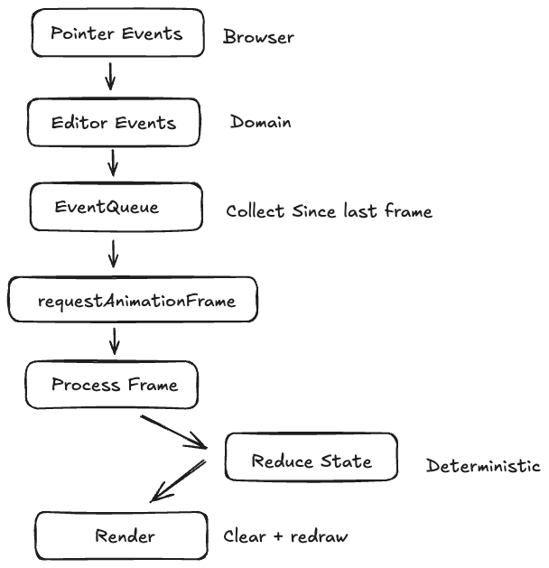

# Editor Architecture

## Overview

Palette is an event driven canvas editor, designed to model user interactions explicity and render efficiently.

## Core Loop

### 1. Pointer Events (Browser)

Native browser events (`pointerdown`, `pointermove`, `pointerup`, `pointercancel`) are captured as they occur.

### 2. Editor Events (Domain)

Browser events are translated into domain-specific editor events.  
This isolates editor logic from browser APIs, keeps the domain model explicit, and helps with testing since we can replay a sequence of events.

### 3. Event Queue

Editor events are queued and stored since the last rendered frame.

### 4. requestAnimationFrame

On each animation frame, the queued events are processed as a batch.

### 5. Process Frame → Reduce State

The accumulated events are then reduced into a new editor state.  
Given the same previous state and the same sequence of events, the result is always deterministic.

### 6. Render

The canvas is cleared and fully redrawn from the current editor state.

When browser pointer events are received, they are translated into domain-specific editor events.  
Editor events are queued and processed in an animation frame.  
State is derived from these events, and that state is then rendered into the canvas element.

## Why requestAnimationFrame?

Pointer interactions can generate hundreds of events per second.  
If rendering occurred immediately for every event, this would result in:

- main thread overload  
- unnecessary redraws  
- increased jank  

The browser typically renders at around 60 frames per second.  
By batching editor events and processing them once per animation frame, we work with the browser and produce smoother interactions.

## Pointer Phase

## Runtime vs Document
